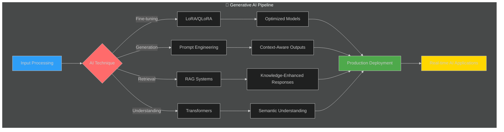
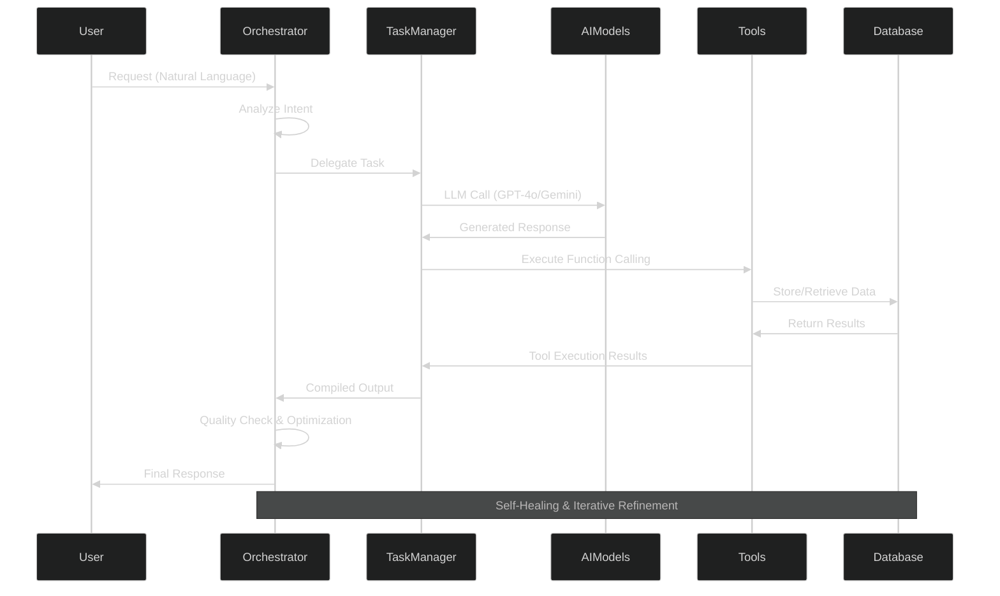

<div align="center">
  
# 👋 Hi, I'm Suyash Agrahari

### Software Engineer @ HireQuotient | Full-Stack Developer | AI Automation Specialist


[](https://linkedin.com/in/suyash-agrahari)
[](mailto:suyashagrahari2121@gmail.com)
[](https://github.com/suyashagrahari)

</div>

---

## 🚀 About Me


🎯 **Software Engineer** building AI-powered solutions at **HireQuotient**

💼 **2+ years** of production experience in full-stack development

🌍 Based in **Bengaluru, India** 🇮🇳

🔭 Currently working on **enterprise automation systems** and **scalable cloud infrastructure**

🌱 Learning **Agentic AI Development**, **Advanced Kubernetes**, and **Microservices Architecture**

💡 Passionate about **performance optimization**, **AI automation**, and **building systems that scale**

⚡ Fun fact: **Scaled an application from 40K to 4.4M users** - that's 11,000% growth! 🚀

---

## 💼 Professional Highlights

<table>
<tr>
<td width="50%">

### 🎯 Impact Metrics
- 🚀 **4.4M** monthly users served
- ⚡ **93%** API performance improvement
- 🤖 **75%** workload reduction via automation
- 📊 **10K+** contacts processed
- 🔧 **70+** AI tool integrations deployed
- 📈 **65%** candidate matching accuracy boost

</td>
<td width="50%">

### 🏆 Key Achievements
- Built enterprise automation platform using n8n, Docker & AWS
- Scaled serverless app from 40K to 4.4M users
- Optimized critical API from 29s to 1.5s response time
- Developed cross-platform mobile apps (Android & iOS)
- Created AI-powered candidate matching system
- Launched AI resume builder with 90+ templates

</td>
</tr>
</table>

---

## 🛠️ Tech Stack

<div align="center">

### 🎨 Frontend Development


### ⚙️ Backend Development


### 🤖 AI & Automation


### 🗄️ Databases & Caching


### ☁️ Cloud & DevOps


### 💻 Languages


### 🔧 Tools & Others


</div>

---

## 🧠 Generative AI & LLM Expertise

<div align="center">
  


</div>

### 🤖 AI Agent Architecture & Frameworks

<table width="100%">
<tr>
<td width="50%" valign="top">

#### 🔗 Agentic AI Systems
```yaml
Multi-Agent Orchestration:
  ├─ LangGraph State Machines
  ├─ Agent-to-Agent (A2A) Protocol
  ├─ JSON-RPC 2.0 Standards
  └─ Dynamic Capability Discovery

Autonomous Agents Built:
  ├─ Orchestrator Agent (Routing)
  ├─ Task Manager Agent
  ├─ Content Generation Agents
  ├─ Code Review Agent (Self-Healing)
  ├─ Recruitment Copilot Agent
  └─ LinkedIn Follow-up Agent

Tool Orchestration:
  ├─ Function Calling
  ├─ Tool Calling
  ├─ Iterative Feedback Loops
  └─ Self-Optimization
```

**Key Achievement:** Built autonomous system with **65% accuracy improvement** through self-optimization!

</td>
<td width="50%" valign="top">

#### 🎨 LLM Frameworks & APIs
```yaml
Core Frameworks:
  ├─ LangChain (Orchestration)
  ├─ LangGraph (State Management)
  ├─ OpenAI SDK (GPT-4o, GPT-5)
  ├─ Google ADK (Gemini API)
  └─ Hugging Face Transformers

Model Integration:
  ├─ GPT-4o / GPT-4o-mini
  ├─ GPT-5 (Latest)
  ├─ Gemini Pro / Flash
  ├─ Claude Sonnet
  └─ Custom Fine-tuned Models

APIs & SDKs:
  ├─ OpenAI API
  ├─ Gemini API
  ├─ Anthropic API
  └─ Hugging Face API
```

**Tech Stack:** 70+ AI tools integrated with **35% traffic growth**

</td>
</tr>
</table>

---

### 🔬 Advanced AI/ML Techniques

<div align="center">



</div>

<table width="100%">
<tr>
<td width="33%" valign="top">

### 🎯 Fine-tuning & Optimization
- **LoRA** (Low-Rank Adaptation)
- **QLoRA** (Quantized LoRA)
- Parameter-Efficient Fine-tuning
- Model Compression Techniques
- Domain-Specific Adaptation
- Transfer Learning

</td>
<td width="33%" valign="top">

### 🔍 RAG & Embeddings
- **Retrieval Augmented Generation**
- Vector Databases (Pinecone, Chroma)
- Semantic Search Implementation
- Embedding Models
- Document Chunking Strategies
- Context Window Management

</td>
<td width="33%" valign="top">

### 🤖 Transformers & Models
- Transformer Architecture
- Attention Mechanisms
- BERT, GPT, T5 Models
- Encoder-Decoder Systems
- Token Generation
- Model Context Protocol (MCP)

</td>
</tr>
</table>

---

### 🔧 AI Engineering Tools & Technologies

<div align="center">


</div>

---

### 📊 Generative AI Skills Proficiency

<div align="center">


</div>

<table width="100%">
<tr>
<td width="50%">

**🤖 AI Frameworks & Agents**
```text
LangChain           ███████████████████░   95%
LangGraph           ██████████████████░░   90%
Multi-Agent Systems ███████████████████░   95%
Tool Orchestration  ████████████████████  100%
Function Calling    ████████████████████  100%
A2A Protocol        ██████████████████░░   90%
```

**🎨 LLM Integration**
```text
OpenAI SDK          ████████████████████  100%
Gemini API          ██████████████████░░   90%
GPT-4o/GPT-5        ███████████████████░   95%
Prompt Engineering  ███████████████████░   95%
Context Management  ██████████████████░░   90%
API Orchestration   ████████████████████  100%
```

</td>
<td width="50%">

**🔬 Advanced AI Techniques**
```text
Transformers        ██████████████████░░   90%
RAG Systems         █████████████████░░░   85%
Fine-tuning (LoRA)  ████████████████░░░░   80%
Embeddings          ██████████████████░░   90%
Semantic Search     █████████████████░░░   85%
Vector Databases    █████████████████░░░   85%
```

**🛡️ AI Safety & Quality**
```text
Guardrails AI       ████████████████░░░░   80%
Output Validation   ██████████████████░░   90%
Error Detection     ███████████████████░   95%
Self-Healing Agents ██████████████████░░   90%
Quality Assurance   ███████████████████░   95%
```

</td>
</tr>
</table>

---

### 🎯 Real-World AI Implementations

<div align="center">

| 🤖 AI System | 🔧 Technologies | 📊 Impact |
|:-------------|:----------------|:----------|
| **Autonomous Candidate Matching** | LangGraph + LangChain + GPT-4o | **65%** accuracy improvement |
| **AI Copilot Agent** | OpenAI SDK + Function Calling | **70%** manual task reduction |
| **Multi-Channel Automation** | n8n + OpenAI + Gemini APIs | **10K+** contacts processed |
| **Self-Healing Code Review** | GPT-5 + Iterative Refinement | **95%+** code quality |
| **Intelligent Follow-up Agent** | Puppeteer + Pattern Analysis | **50%** response rate boost |

</div>

---

### 🔄 AI Agent Workflow Architecture

<div align="center">



</div>

---

## 📊 Skill Proficiency

<table width="100%">
<tr>
<td width="50%">

**Frontend Development**
```text
React.js         ████████████████████  100%
TypeScript       ███████████████████░   95%
Next.js          ██████████████████░░   90%
Tailwind CSS     ███████████████████░   95%
Redux            █████████████████░░░   85%
```

**Backend Development**
```text
Node.js          ████████████████████  100%
Express.js       ███████████████████░   95%
GraphQL          ████████████████░░░░   80%
REST APIs        ████████████████████  100%
Socket.io        ██████████████████░░   90%
```

</td>
<td width="50%">

**Cloud & DevOps**
```text
AWS              ███████████████████░   95%
Docker           ████████████████████  100%
Kubernetes       ████████████████░░░░   80%
CI/CD            ██████████████████░░   90%
Nginx            ███████████████████░   95%
```

**AI & Data**
```text
LangChain        ██████████████████░░   90%
MongoDB          ████████████████████  100%
PostgreSQL       ███████████████████░   95%
Redis            ██████████████████░░   90%
Vector DB        ████████████████░░░░   80%
```

</td>
</tr>
</table>

---

## 📊 GitHub Statistics

<div align="center">
  


</div>

<div align="center">
  
[](https://git.io/streak-stats)

</div>

<div align="center">
  


</div>

<div align="center">

<a href="https://github.com/suyashagrahari">
  
</a>

</div>

---

## 🏢 Professional Experience


### 💼 Software Engineer @ HireQuotient
**📅 May 2024 - Present | 📍 Bengaluru, India**

**🎯 Key Achievements:**
- ⚡ Optimized API performance by **93%** (29s → 1.5s)
- 📈 Scaled application to **4.4M monthly users** (11,000% growth)
- 🤖 Built AI automation processing **10,000+ contacts**
- 📱 Launched cross-platform mobile apps on **Google Play Store**
- 🎨 Created AI resume builder with **90+ templates**
- 🔧 Integrated **70+ AI-powered workflow tools**

**💻 Tech Stack:** Node.js, React.js, Docker, AWS, MongoDB, LangChain, n8n

---

### 💼 Full Stack Developer @ Health Umbrella Foundation
**📅 August 2022 - July 2023 | 📍 Jaipur, India**

- 🚀 Increased user engagement by **30%** through responsive design
- 🔒 Reduced security vulnerabilities by **50%**
- ⚡ Improved frontend performance by **40%**
- 🛠️ Built scalable backend solutions with Node.js & Express.js

---

## 🎓 Education

**B.Tech in Computer Science & Engineering**  
The LNM Institute of Information Technology, Jaipur  
**2020 - 2024**

---

## 🌟 Featured Projects

<table>
<tr>
<td width="50%">

### 🤖 AI-Powered Recruitment Platform
**n8n | LangChain | Docker | AWS**

Enterprise automation system processing 10,000+ contacts with:
- Multi-channel outreach (Email, SMS, LinkedIn)
- AI-powered message personalization
- 75% reduction in manual workload
- Self-hosted infrastructure optimization

</td>
<td width="50%">

### 🎵 Serverless Media Downloader
**AWS Lambda | Node.js | FFmpeg**

YouTube media downloader supporting:
- Multiple formats (MP3, MP4, WAV)
- Quality options (360p - 1080p)
- Scaled from 40K to 4.4M monthly users
- 11,000% traffic growth achieved

</td>
</tr>
<tr>
<td width="50%">

### 📱 Cross-Platform Mobile App
**React | Ionic | Capacitor**

Android & iOS applications featuring:
- Launched on Google Play Store
- 40% increase in user engagement
- Responsive UI/UX design
- Real-time data synchronization

</td>
<td width="50%">

### ⚡ API Performance Optimization
**Node.js | MongoDB | Redis**

Backend optimization project achieving:
- 93% response time improvement (29s → 1.5s)
- MongoDB aggregation pipeline optimization
- Redis caching implementation
- Asynchronous Promise.all() patterns

</td>
</tr>
</table>

---

## 📈 Contribution Graph

<div align="center">
  
[](https://github.com/suyashagrahari)

</div>

### 🐍 Contribution Snake

<div align="center">
  


</div>

> **Note:** To enable the snake animation, add this [GitHub Action](https://github.com/Platane/snk) to your profile repository.

---

## 🏆 GitHub Trophies

<div align="center">
  
[](https://github.com/suyashagrahari)

</div>

---

## 💡 What I'm Currently Working On

<div align="center">
<table>
<tr>
<td width="33%" valign="top">

### 📚 Learning
- 🤖 Agentic AI with LangGraph
- ☸️ Advanced Kubernetes
- 🏗️ Microservices Patterns
- ☁️ Cloud-Native Design

</td>
<td width="33%" valign="top">

### 🛠️ Building
- 🔄 Enterprise automation
- 🎯 AI recruitment tools
- 📊 Scalable infrastructure
- ⚡ Performance solutions

</td>
<td width="33%" valign="top">

### 🔍 Exploring
- 🗄️ Vector Databases (RAG)
- 📡 Event-Driven Architecture
- 🚀 Serverless at Scale
- ✍️ Technical Writing

</td>
</tr>
</table>
</div>

---

## 📝 Latest Blog Posts

<!-- BLOG-POST-LIST:START -->
- Coming Soon: Building Scalable AI Automation Systems
- Coming Soon: From 40K to 4.4M Users - A Scaling Journey
- Coming Soon: Optimizing Node.js APIs for Production
<!-- BLOG-POST-LIST:END -->

---

## 💬 Ask Me About

- 🚀 Full-Stack Development with MERN Stack
- 🤖 AI Integration & Automation (LangChain, LangGraph)
- ☁️ Cloud Architecture & AWS Services
- 🐳 Docker & Kubernetes Orchestration
- ⚡ API Performance Optimization
- 📱 Cross-Platform Mobile Development
- 🔄 CI/CD Pipeline Implementation
- 🎯 Building Scalable Systems

---

## 🤝 Let's Connect!

I'm always interested in collaborating on innovative projects, especially those involving:
- 🤖 AI-powered applications and automation
- ☁️ Cloud-native architecture and scalability
- 🚀 Performance optimization challenges
- 🌐 Full-stack development opportunities

<div align="center">

### 📫 How to Reach Me

[](mailto:suyashagrahari2121@gmail.com)
[](https://linkedin.com/in/suyash-agrahari)
[](https://github.com/suyashagrahari)
[](tel:+918957089392)

</div>

---

## 📊 Profile Views & Stats

<div align="center">
  


</div>

---

<div align="center">

### 💭 Random Dev Quote


### 😄 Here's a Joke for You


---

### ⭐️ From [suyashagrahari](https://github.com/suyashagrahari)

**"Building scalable solutions, one commit at a time."** 🚀

</div>

---

<div align="center">
  
## 🎯 2025 Goals

- [ ] Contribute to 10+ open-source projects
- [ ] Build and launch 3 production-ready AI applications
- [ ] Write 20+ technical blog posts
- [ ] Mentor 5+ aspiring developers
- [ ] Achieve AWS Solutions Architect certification
- [ ] Scale personal projects to 100K+ users

**"The best way to predict the future is to create it."** - Peter Drucker

</div>
