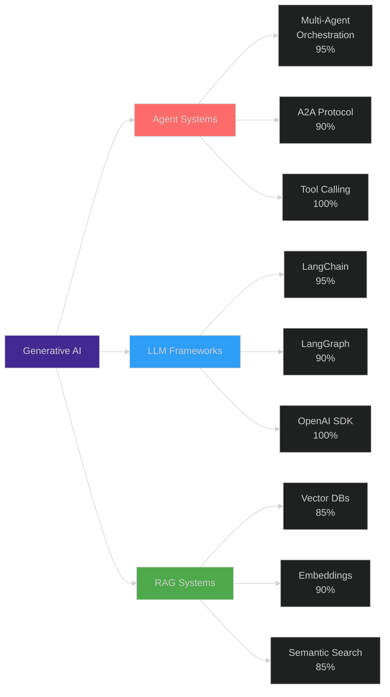
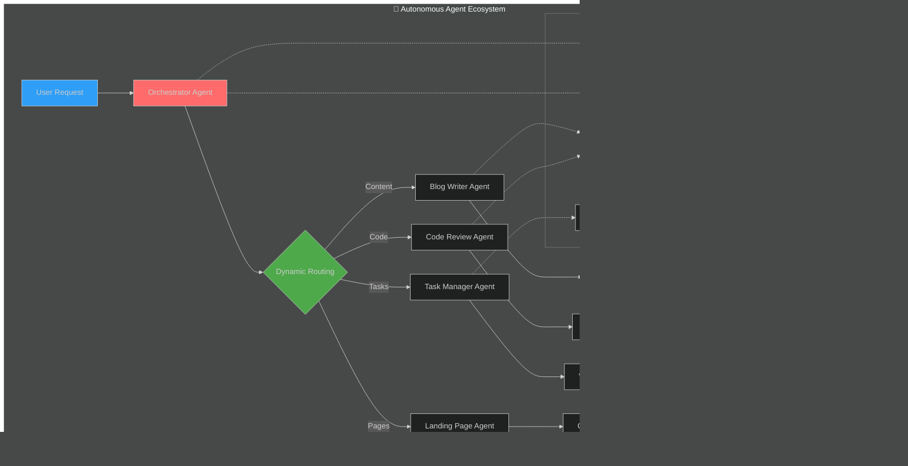
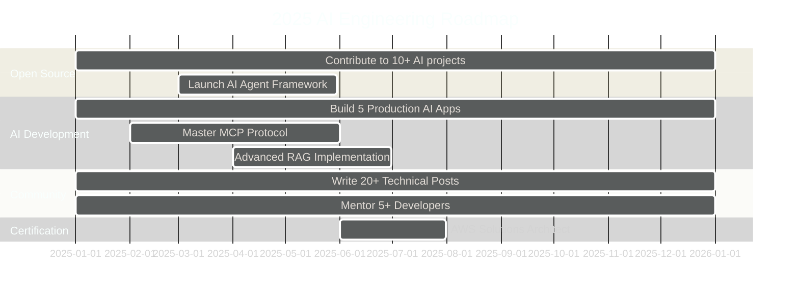

<div align="center">

# 👋 Hi, I'm Suyash Agrahari

### AI Engineer | Full-Stack Developer | Building Intelligent Autonomous Systems


[](https://linkedin.com/in/suyash-agrahari)
[](mailto:suyashagrahari2121@gmail.com)
[](https://github.com/suyashagrahari)
[](tel:+918957089392)

</div>

---

## 🚀 About Me


🤖 **AI Engineer** specializing in **Autonomous Agent Systems** and **Generative AI**

💼 **2+ years** building production-grade AI-powered solutions

🌍 Based in **Bengaluru, India** 🇮🇳

🔭 Working on **Multi-Agent Systems**, **Agentic Workflows**, and **AI Orchestration**

🌱 Deep diving into **Agent-to-Agent Protocols**, **Model Context Protocol**, and **Advanced RAG**

💡 Passionate about **AI automation**, **intelligent agents**, and **scalable AI infrastructure**

⚡ **Key Achievement**: Built autonomous AI agent system that improved candidate matching accuracy by **65%** through iterative self-optimization!

---

## 🎯 AI Engineering Highlights

<div align="center">

| 🤖 AI Systems | ⚡ Performance | 🎯 Impact |
|:---:|:---:|:---:|
| **10** Autonomous Agents Built | **93%** API Optimization | **65%** Matching Accuracy |
| **70+** AI Tool Integrations | **75%** Manual Workload Reduction | **4.4M** Users Scaled |
| **Multi-Agent Orchestration** | **50%** Response Rate Improvement | **11,000%** Traffic Growth |

</div>

---

## 🧠 Generative AI & Agent Expertise

<table>
<tr>
<td width="50%" valign="top">

### 🤖 Autonomous Agent Systems
```python
🔹 Multi-Agent Orchestration
  └─ Agent-to-Agent (A2A) Protocol
  └─ JSON-RPC 2.0 Standards
  └─ Dynamic Capability Discovery

🔹 Intelligent Agents Built
  └─ Orchestrator Agent (Routing & Coordination)
  └─ Task Manager (Workflow Management)
  └─ Content Generation (Blog Writer/Editor)
  └─ Code Review Agent (Self-Healing)
  └─ Landing Page Generator
  └─ Interview Automation Agent
  └─ Recruitment Copilot Agent
  └─ LinkedIn Follow-up Agent

🔹 Agentic Workflows
  └─ LangGraph State Machines
  └─ Tool Calling & Function Calling
  └─ Iterative Feedback Loops
  └─ Self-Optimization Systems
```

</td>
<td width="50%" valign="top">

### 🎨 Generative AI Technologies
```javascript
🔹 LLM Frameworks
  └─ LangChain (Tool Orchestration)
  └─ LangGraph (State Management)
  └─ OpenAI SDK (GPT-4o, GPT-5)
  └─ Google ADK (Gemini API)

🔹 Advanced Techniques
  └─ RAG (Retrieval Augmented Generation)
  └─ Fine-tuning (LoRA, QLoRA)
  └─ Prompt Engineering
  └─ Context Management
  └─ Semantic Search

🔹 Vector & Embeddings
  └─ Vector Databases (Pinecone, Chroma)
  └─ Embedding Models
  └─ Semantic Similarity
  └─ Document Retrieval

🔹 AI Safety & Quality
  └─ Guardrails AI
  └─ Output Validation
  └─ Error Detection & Self-Healing
```

</td>
</tr>
</table>

---

## 🛠️ Complete Tech Arsenal

<div align="center">

### 🤖 AI & Machine Learning


### 🎨 Frontend Development


### ⚙️ Backend & APIs


### 🗄️ Databases & Caching


### ☁️ Cloud & DevOps


### 🔧 Automation & Tools


</div>

---

## 📊 AI Engineering Proficiency

<div align="center">



</div>

<table width="100%">
<tr>
<td width="50%">

**🤖 AI & Agent Technologies**
```text
LangChain          ███████████████████░   95%
LangGraph          ██████████████████░░   90%
OpenAI SDK         ████████████████████  100%
Multi-Agent        ███████████████████░   95%
Tool Calling       ████████████████████  100%
Function Calling   ████████████████████  100%
RAG Systems        █████████████████░░░   85%
```

**💻 Full-Stack Development**
```text
React.js           ████████████████████  100%
Node.js            ████████████████████  100%
TypeScript         ███████████████████░   95%
Next.js 16         ██████████████████░░   90%
Express.js         ███████████████████░   95%
```

</td>
<td width="50%">

**☁️ Cloud & Infrastructure**
```text
AWS Services       ███████████████████░   95%
Docker             ████████████████████  100%
Lambda             ██████████████████░░   90%
Nginx              ███████████████████░   95%
CI/CD              ██████████████████░░   90%
```

**🗄️ Data & Databases**
```text
MongoDB            ████████████████████  100%
Vector DBs         █████████████████░░░   85%
PostgreSQL         ███████████████████░   95%
Redis              ██████████████████░░   90%
Embeddings         ██████████████████░░   90%
```

</td>
</tr>
</table>

---

## 💼 Professional Experience

### 🏢 Software Engineer @ HireQuotient
**📅 May 2024 - Present | 📍 Bengaluru, India**

<details open>
<summary><b>🤖 Autonomous AI Agent Systems</b></summary>
<br>

- 🧠 Engineered autonomous AI agent system using **LangGraph state machines** and **LangChain tool calling** to orchestrate intelligent candidate matching
- 🎯 Implemented iterative feedback loops and self-optimization achieving **65% improvement in matching accuracy**
- 🔄 Dynamically generates search filters, executes automated vetting, and optimizes parameters until achieving **50%+ quality threshold**
- ⭐ Extracts high-quality candidates with 4-5 star ratings through intelligent scoring

</details>

<details>
<summary><b>🤖 AI Copilot Agent Development</b></summary>
<br>

- 💬 Created AI-powered copilot using **OpenAI SDK** and **function calling** for natural language recruitment automation
- 🚀 Automated project creation, intelligent filtering, sourcing, profile enrichment, and multi-channel outreach
- ⚡ Achieved **70% reduction in manual tasks** through tool orchestration and AI insights generation

</details>

<details>
<summary><b>🔧 Enterprise AI Automation Platform</b></summary>
<br>

- 🛠️ Developed platform using **n8n**, **OpenAI API**, **Gemini API**, **Node.js**, **Docker**, and **AWS EC2**
- 📧 Orchestrated intelligent multi-channel campaigns across email, SMS, and LinkedIn
- 📊 Scaled to **10,000+ contacts** while reducing manual workload by **75%**
- 🤖 Integrated **70+ AI tools** achieving **35% website traffic growth**

</details>

<details>
<summary><b>⚡ Performance & Scale Achievements</b></summary>
<br>

- 🚀 Optimized backend API from **29s to 1.5s** (**93% improvement**) using MongoDB aggregation, Redis, and async patterns
- 📈 Scaled serverless YouTube downloader from **40K to 4.4M monthly users** (**11,000% growth**)
- 🎨 Launched AI resume builder with **90+ ATS-friendly templates** in 20 days
- 📝 Restored **3,000+ archived blogs** via Strapi CMS, increasing SEO performance by **50%**

</details>

---

## 🎯 Featured AI Projects

<div align="center">

### 🏆 Flagship Projects

</div>

<table>
<tr>
<td width="50%" valign="top">

### 🤖 Autonomous Multi-Agent System
**Agent-to-Agent Protocol | LangChain | GPT-4o**


**Key Features:**
- 🔗 **A2A Protocol** implementation with JSON-RPC 2.0
- 🤖 **10 Specialized Agents**: Orchestrator, Task Manager, Blog Writer/Editor, Code Review, Landing Page Generator
- 🔄 **Dynamic Orchestration** with capability discovery
- 🧠 **Intelligent Routing** using OpenAI function calling
- 💾 **Stateful Conversations** with LangChain BufferMemory
- 🛠️ **Self-Healing Code Review** with iterative refinement (95%+ quality)

**Tech Stack:**
- Express.js, Next.js 16, TypeScript, MongoDB
- OpenAI SDK (GPT-4o-mini, GPT-5)
- LangChain, Function Calling
- A2A Client Library

**Architecture Highlights:**
```javascript
Multi-Step Workflow (4-Step Blog Generation):
Keyword Extraction → Writing → Editing → Persistence
```

[View Project →](https://github.com/suyashagrahari)

</td>
<td width="50%" valign="top">

### 🎤 AI Interview Platform with Proctoring
**OpenAI API | Next.js | Real-Time AI**


**Key Features:**
- 💼 **AI Interview Automation** based on JD, resume & company context
- 🗣️ **Text-to-Speech** using Kokoro TTS for natural voice
- 📊 **Analytics Engine** generating comprehensive reports
- 🔒 **Anti-Cheating System**: Face detection, tab monitoring, copy-paste detection (95%+ accuracy)
- 🤖 **Adaptive Conversation** using function calling
- 📈 **Performance Scoring** with strengths/weaknesses analysis

**Tech Stack:**
- Next.js, Node.js, MongoDB
- OpenAI API, Kokoro TTS
- Function Calling, Context Retention

**AI Capabilities:**
```python
Dynamic Question Generation
+ Context Retention
+ Intelligent Navigation
= Adaptive Interview Flow
```

[View Project →](https://github.com/suyashagrahari)

</td>
</tr>
</table>

<table>
<tr>
<td width="50%" valign="top">

### 📧 Intelligent LinkedIn Follow-up Agent
**Puppeteer | RabbitMQ | Event-Driven**

- 🎯 Automatically triggers personalized messages
- 📊 Engagement pattern analysis
- 🤖 Behavioral tracking & dynamic decisions
- 📈 **50% improvement** in response rates

**Architecture:**
```
Event Detection → Pattern Analysis → 
Dynamic Message → Personalization
```

</td>
<td width="50%" valign="top">

### 🎵 Serverless Media Downloader
**AWS Lambda | FFmpeg | Node.js**

- 📹 Multiple formats: MP3, MP4, WAV
- 🎯 Quality options: 360p - 1080p
- 🚀 Scaled: **40K → 4.4M users** (11,000% growth)
- ⚡ Serverless architecture at scale

**Growth Metrics:**
```
Month 1: 40,000 users
Month 12: 4,400,000 users
Growth: 11,000% 🚀
```

</td>
</tr>
</table>

---

## 🎨 AI System Architecture Visualization

<div align="center">



</div>

---

## 📈 GitHub Statistics

<div align="center">


</div>

<div align="center">
  
[](https://git.io/streak-stats)

</div>

---

## 🏆 GitHub Trophies

<div align="center">
  
[](https://github.com/suyashagrahari)

</div>

---

## 📈 Contribution Activity

<div align="center">
  
[](https://github.com/suyashagrahari)

</div>

---

## 💡 Current Focus & Learning

<div align="center">

<table>
<tr>
<td width="33%" valign="top" align="center">

### 🎯 Building

🤖 Multi-Agent Systems
🔗 Agent-to-Agent Protocols
🧠 Advanced RAG Systems
🎨 AI-Powered Copilots
📊 Intelligent Automation

</td>
<td width="33%" valign="top" align="center">

### 📚 Learning

🔬 Model Context Protocol (MCP)
🎯 Advanced Fine-tuning
🗄️ Vector Database Optimization
🔄 Event-Driven AI Systems
🛡️ AI Safety & Guardrails

</td>
<td width="33%" valign="top" align="center">

### 🔍 Exploring

🌐 Distributed Agent Networks
⚡ Real-Time AI Processing
🧪 Agentic Workflow Patterns
🎨 Generative UI Systems
🚀 Production AI at Scale

</td>
</tr>
</table>

</div>

---

## 💬 Technical Expertise

<div align="center">

### 🎯 Ask Me About

</div>

<table>
<tr>
<td width="50%">

**🤖 AI & Agents**
- Multi-Agent System Architecture
- LangChain & LangGraph Orchestration
- Agent-to-Agent (A2A) Protocols
- Autonomous Agent Development
- Tool Calling & Function Calling
- RAG Implementation & Optimization
- Prompt Engineering Best Practices

</td>
<td width="50%">

**💻 Full-Stack & Cloud**
- MERN Stack Development
- Next.js 16 & React Server Components
- AWS Serverless Architecture
- API Performance Optimization
- Docker & Container Orchestration
- Real-Time Systems with WebSockets
- Scalable System Design

</td>
</tr>
</table>

---

## 🎯 2025 Goals & Roadmap

<div align="center">



</div>

**Concrete Targets:**
- [ ] 🤖 Build and deploy 5 production-ready AI agent systems
- [ ] 📝 Write 20+ in-depth technical blog posts on AI engineering
- [ ] 🌟 Contribute to 10+ open-source AI/ML projects
- [ ] 👨‍🏫 Mentor 5+ aspiring AI engineers
- [ ] 🏅 Achieve AWS Solutions Architect Professional certification
- [ ] 📈 Scale personal AI projects to 100K+ active users
- [ ] 🎯 Master Model Context Protocol (MCP) implementation
- [ ] 🚀 Launch comprehensive AI Agent Framework

---

## 🤝 Let's Build Together!

<div align="center">

I'm actively seeking opportunities in **AI Engineering**, **Generative AI Development**, and **Multi-Agent Systems**!

Particularly interested in:
- 🤖 Building production-grade autonomous agent systems
- 🧠 Developing advanced RAG and LLM applications
- 🔗 Implementing multi-agent orchestration frameworks
- ☁️ Designing scalable AI infrastructure
- 🎯 Creating intelligent automation platforms

### 📫 Connect With Me

[](mailto:suyashagrahari2121@gmail.com)
[](https://linkedin.com/in/suyash-agrahari)
[](https://github.com/suyashagrahari)
[](https://wa.me/918957089392)

</div>

---

<div align="center">

## 💭 Philosophy

**"Building intelligent systems that don't just automate tasks, but autonomously optimize themselves."**

### 📊 Profile Statistics


---

### 😄 Developer Humor


---

### ⭐️ From [suyashagrahari](https://github.com/suyashagrahari)

**"From 40K to 4.4M users - Building scalable AI solutions, one autonomous agent at a time."** 🚀🤖

*Last Updated: January 2025*

</div>
