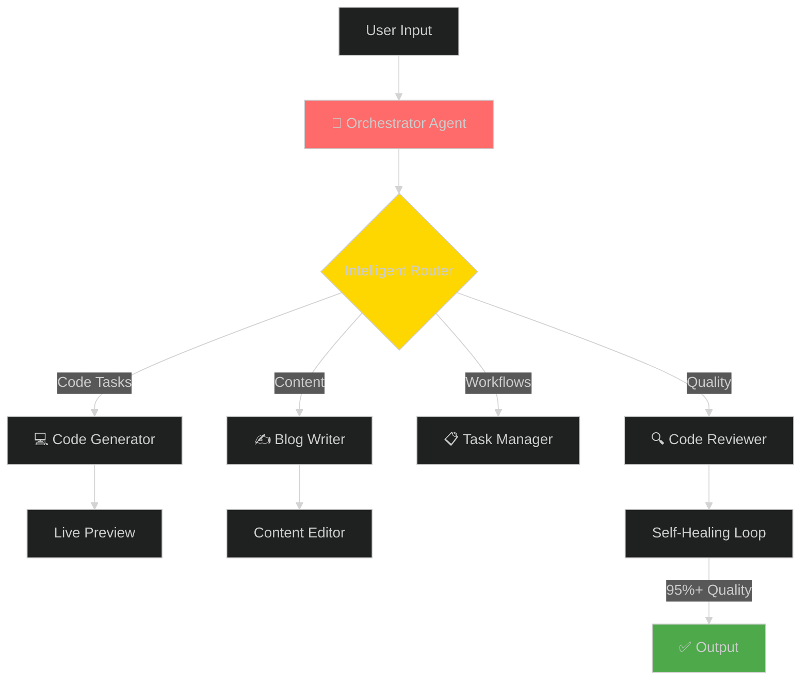
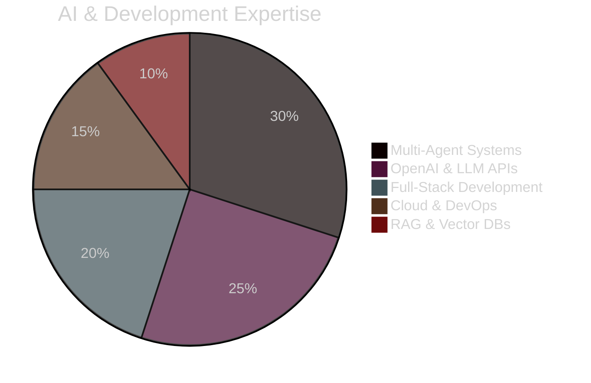

# 👋 Hi, I'm Suyash Agrahari

<div align="center">

### 🤖 AI Engineer @ HireQuotient | Building Autonomous Multi-Agent Systems

[](https://linkedin.com/in/suyash-agrahari)
[](mailto:suyashagrahari2121@gmail.com)
[](https://github.com/suyashagrahari)

</div>

---

## 🎯 Quick Wins

```
🚀 Scaled app: 40K → 4.4M users (11,000% growth)
⚡ API optimization: 29s → 1.5s (93% faster)
🤖 Built 10+ autonomous AI agents
📊 Processed 10K+ contacts via AI automation
🎯 65% accuracy boost through self-optimizing agents
```

---

## 🛠️ Tech Arsenal

<div align="center">

### 🤖 Generative AI & LLM


### 💻 Full-Stack


### ☁️ Cloud & DevOps


### 🗄️ Databases


</div>

---

## 🤖 Multi-Agent Architecture



---

## 📊 Skill Mastery



**AI/ML Stack**
```
LangChain/LangGraph    ████████████████████ 95%
Multi-Agent Systems    ████████████████████ 95%
OpenAI API Integration ████████████████████ 100%
RAG & Vector Search    ██████████████████░░ 90%
Fine-tuning (LoRA)     ████████████████░░░░ 80%
```

**Full-Stack**
```
React/Next.js          ████████████████████ 95%
Node.js/Express        ████████████████████ 100%
AWS & Cloud            ███████████████████░ 95%
Docker/Kubernetes      ████████████████░░░░ 80%
```

---

## 🏆 Featured Projects

### 🤖 Autonomous Multi-Agent System
**LangChain • LangGraph • GPT-4o • A2A Protocol**

10 specialized agents with self-healing capabilities, achieving 65% accuracy improvement through iterative optimization.

- ✅ Agent-to-Agent (A2A) communication
- ✅ Self-optimizing feedback loops  
- ✅ JSON-RPC 2.0 standards
- ✅ 95%+ code quality

### 🎤 AI Interview Platform
**OpenAI API • Next.js • Kokoro TTS**

AI-driven interview automation with real-time proctoring and 95%+ anti-cheating accuracy.

- ✅ Dynamic contextual questioning
- ✅ Voice integration (TTS)
- ✅ Real-time face detection
- ✅ Performance analytics

### 🚀 Serverless Media Platform
**AWS Lambda • Node.js • FFmpeg**

Scaled from 40K to 4.4M monthly users (11,000% growth).

- ✅ Multiple format support
- ✅ Quality optimization
- ✅ Serverless architecture
- ✅ Global CDN delivery

---

## 📈 GitHub Analytics

<div align="center">

[](https://git.io/streak-stats)


[](https://github.com/suyashagrahari)

</div>

---

## 💼 Experience Highlights

**🤖 Software Engineer @ HireQuotient** | *May 2024 - Present*

- Built autonomous AI agent ecosystem with 65% matching improvement
- Reduced manual workload by 70% through intelligent automation
- Integrated 70+ AI tools driving 35% traffic growth
- Optimized APIs achieving 93% performance boost

**💻 Full Stack Developer @ Health Umbrella** | *Aug 2022 - Jul 2023*

- Increased engagement by 30% through responsive design
- Reduced security vulnerabilities by 50%
- Improved performance by 40%

---

## 🎯 Currently Building

```yaml
Learning:
  - Advanced Agentic AI (LangGraph)
  - Model Context Protocol (MCP)
  - Kubernetes at Scale
  
Building:
  - Distributed Multi-Agent Networks
  - Production AI Recruitment Tools
  - Real-time AI Processing Systems
  
Exploring:
  - Advanced RAG Architectures
  - Event-Driven AI Systems
  - Fine-tuning Optimization
```

---

## 💬 Let's Connect!

<div align="center">

**Open to collaborate on:**
🤖 Multi-Agent Systems | 🧠 RAG Pipelines | ☁️ AI Infrastructure | 🎯 LLM Applications

[](mailto:suyashagrahari2121@gmail.com)
[](https://linkedin.com/in/suyash-agrahari)
[](tel:+918957089392)


---

### 💭 Quote


---

*"Building autonomous AI systems that don't just automate tasks, but intelligently optimize themselves."* 🚀

</div>
