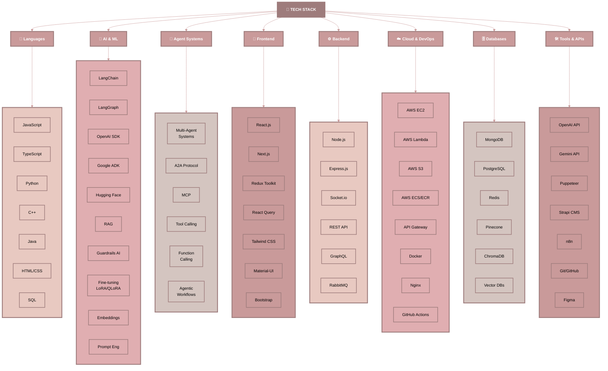
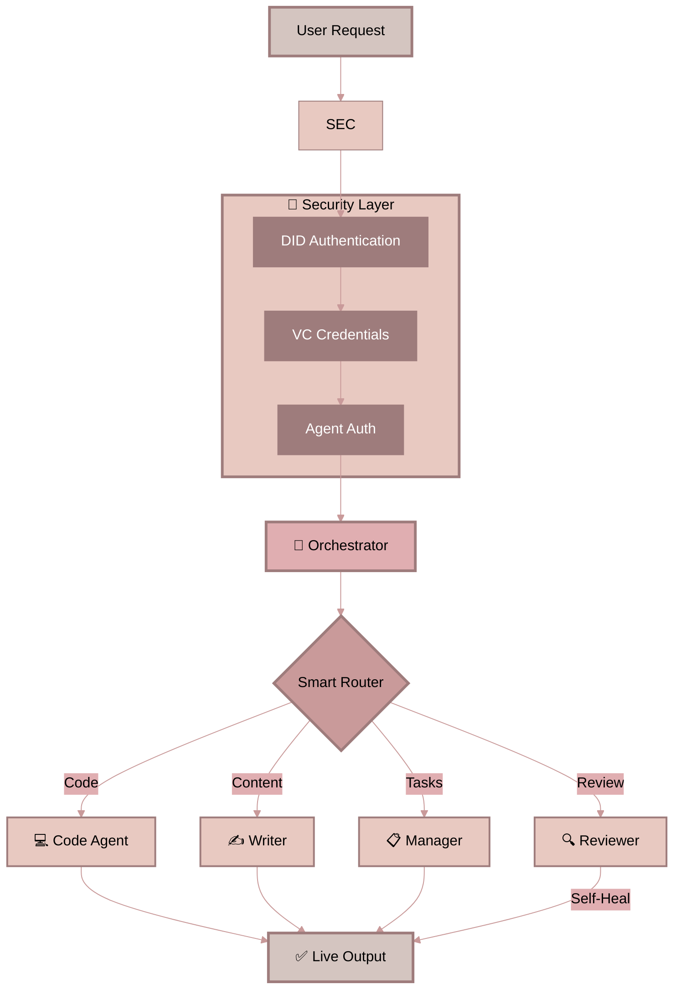

# 👋 Hi, I'm Suyash Agrahari

### 💻 Software Engineer | Building Intelligent Multi-Agent Systems | AI Enthusiast

)

)

---

## 🚀 About Me

**Software Engineer specializing in autonomous multi-agent systems and scalable full-stack solutions.**

I build intelligent systems that think and adapt. At HireQuotient, I engineered autonomous AI agents using LangChain, LangGraph, and vector databases that improved matching accuracy by 65%. I've architected multi-agent systems with A2A protocols where 10+ specialized agents collaborate to automate complex workflows—from content generation to self-healing code reviews. My work spans the full stack: optimizing backends (reduced API time from 29s to 1.5s), building React/Next.js frontends, and scaling systems from 40K to 4.4M users.

**My edge:** Fast learner who thrives on complex challenges. I discovered coding in my third year of college and quickly moved to shipping production AI systems. Whether it's orchestrating agentic workflows, implementing RAG pipelines with vector search, or deploying scalable Dockerized solutions on AWS—I turn ambitious technical ideas into working products quickly.

**Tech Stack:** `LangChain` • `Multi-Agent Systems` • `Vector Databases` • `OpenAI API` • `Node.js` • `React/Next.js` • `MongoDB` • `Docker` • `AWS`

## 💻 Tech Stack Architecture

---

## 🤖 Multi-Agent Security Architecture ( Working )

**Security Features:** DID Decentralized Identity • VC Verifiable Credentials • Multi-Agent Authentication

