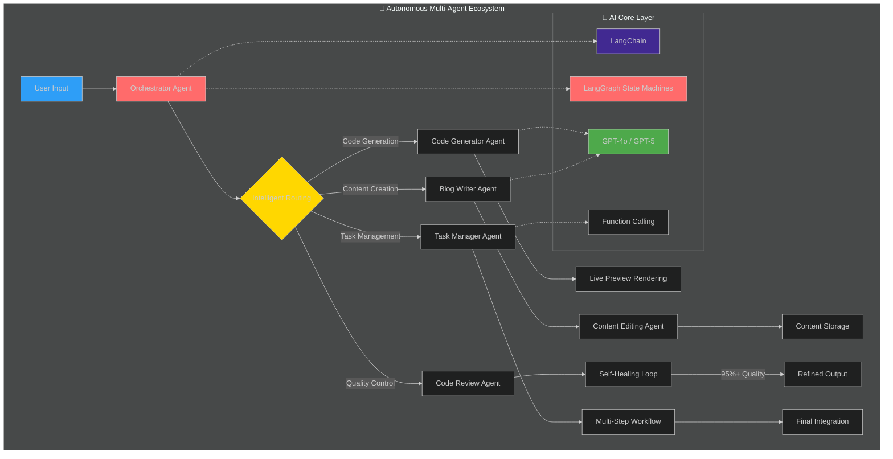
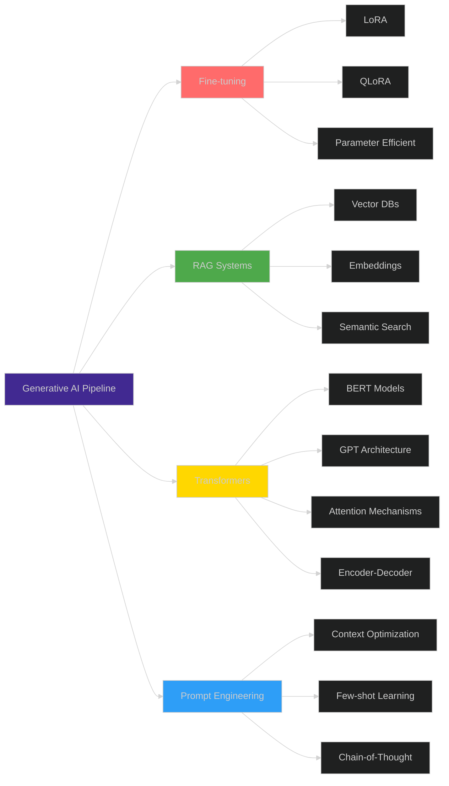
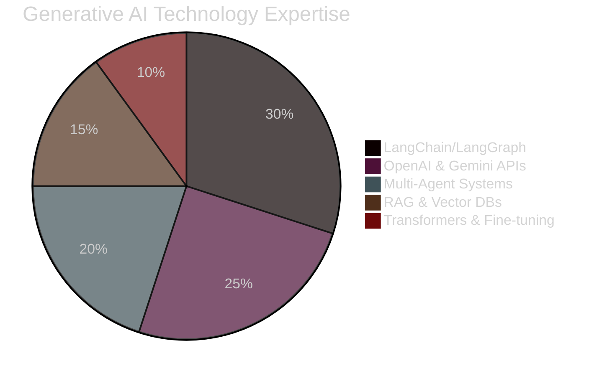

<div align="center">
  
# 👋 Hi, I'm Suyash Agrahari

### Software Engineer @ HireQuotient | Full-Stack Developer | Generative AI Specialist


[](https://linkedin.com/in/suyash-agrahari)
[](mailto:suyashagrahari2121@gmail.com)
[](https://github.com/suyashagrahari)

</div>

---

## 🚀 About Me


🎯 **Software Engineer** building **AI-powered solutions** at **HireQuotient**

🤖 **Generative AI Specialist** - Expert in building **Autonomous Multi-Agent Systems** and **AI Orchestration**

💼 **2+ years** of production experience in **full-stack development** and **AI automation**

🌍 Based in **Bengaluru, India** 🇮🇳

🔭 Currently working on **enterprise automation systems**, **scalable cloud infrastructure**, and **intelligent AI agents**

🌱 Learning **Agentic AI Development**, **Advanced Kubernetes**, **Model Context Protocol**, and **Microservices Architecture**

💡 Passionate about **performance optimization**, **AI automation**, **multi-agent orchestration**, and **building systems that scale**

⚡ **Fun fact:** Scaled an application from **40K to 4.4M users** - that's **11,000% growth**! 🚀

🏆 Built **autonomous AI agent system** that improved candidate matching accuracy by **65%** through **self-optimization**!

---

## 💼 Professional Highlights

<table>
<tr>
<td width="50%">

### 🎯 Impact Metrics
- 🚀 **4.4M** monthly users served
- ⚡ **93%** API performance improvement
- 🤖 **75%** workload reduction via AI automation
- 📊 **10K+** contacts processed by AI agents
- 🔧 **70+** AI tool integrations deployed
- 📈 **65%** candidate matching accuracy boost
- 🎨 **90+** AI-powered resume templates

</td>
<td width="50%">

### 🏆 Key Achievements
- Built **autonomous multi-agent system** with A2A protocol
- Engineered **enterprise AI automation platform** (n8n, Docker, AWS)
- Scaled **serverless app from 40K to 4.4M users**
- Optimized critical API from **29s to 1.5s** response time
- Developed **cross-platform mobile apps** (Android & iOS)
- Created **AI-powered candidate matching system**
- Launched **AI resume builder** in 20 days
- Integrated **LangChain, LangGraph, GPT-4o, Gemini**

</td>
</tr>
</table>

---

## 🛠️ Tech Stack

<div align="center">

### 🎨 Frontend Development


### ⚙️ Backend Development


### 🤖 Generative AI & LLM


### 🗄️ Databases & Caching


### ☁️ Cloud & DevOps


### 💻 Languages & Tools


</div>

---

## 🧠 Generative AI & Multi-Agent Expertise

<div align="center">
  


</div>

### 🤖 AI Agent Architecture & Orchestration

<div align="center">



</div>

<table width="100%">
<tr>
<td width="50%" valign="top">

#### 🔗 Agentic AI Systems
```yaml
Multi-Agent Orchestration:
  ├─ LangGraph State Machines
  ├─ Agent-to-Agent (A2A) Protocol
  ├─ JSON-RPC 2.0 Standards
  └─ Dynamic Capability Discovery

10 Autonomous Agents Built:
  ├─ 🎯 Orchestrator Agent (Intelligent Routing)
  ├─ 📋 Task Manager Agent (Workflow Coordination)
  ├─ ✍️ Blog Writer Agent (Content Generation)
  ├─ ✏️ Content Editor Agent (Refinement)
  ├─ 💻 Code Generator Agent (Live Preview)
  ├─ 🔍 Code Review Agent (Self-Healing)
  ├─ 🎨 Landing Page Generator
  ├─ 🤝 Recruitment Copilot Agent
  ├─ 📧 LinkedIn Follow-up Agent
  └─ 🎤 Interview Automation Agent

Tool Orchestration:
  ├─ Function Calling
  ├─ Tool Calling
  ├─ Iterative Feedback Loops
  └─ Self-Optimization (65% improvement!)
```

</td>
<td width="50%" valign="top">

#### 🎨 LLM Integration & APIs
```yaml
Core Frameworks:
  ├─ LangChain (Tool Orchestration)
  ├─ LangGraph (State Management)
  ├─ OpenAI SDK (GPT-4o, GPT-5)
  ├─ Google ADK (Gemini API)
  └─ Hugging Face Transformers

Model Integration:
  ├─ GPT-4o / GPT-4o-mini
  ├─ GPT-5 (Latest Models)
  ├─ Gemini Pro / Flash
  ├─ Claude Sonnet
  └─ Custom Fine-tuned Models

Production APIs:
  ├─ OpenAI API (Function Calling)
  ├─ Gemini API (Multi-modal)
  ├─ Anthropic API
  └─ Hugging Face Inference API

RAG & Vector Systems:
  ├─ Pinecone (Vector Database)
  ├─ ChromaDB (Embeddings)
  ├─ Semantic Search
  └─ Context Management
```

</td>
</tr>
</table>

---

### 🔬 Advanced AI/ML Techniques & Transformers

<div align="center">



</div>

<table width="100%">
<tr>
<td width="33%" valign="top">

### 🎯 Fine-tuning & Optimization
- **LoRA** (Low-Rank Adaptation)
- **QLoRA** (Quantized LoRA)
- Parameter-Efficient Fine-tuning (PEFT)
- Model Compression & Quantization
- Domain-Specific Adaptation
- Transfer Learning Strategies
- Custom Model Training

</td>
<td width="33%" valign="top">

### 🔍 RAG & Embeddings
- **Retrieval Augmented Generation**
- Vector Databases (Pinecone, Chroma)
- Semantic Search Implementation
- Embedding Models (text-embedding-3)
- Document Chunking & Processing
- Context Window Management
- Hybrid Search (Dense + Sparse)

</td>
<td width="33%" valign="top">

### 🤖 Transformers & Architecture
- Transformer Architecture Deep Dive
- Multi-Head Attention Mechanisms
- BERT, GPT, T5 Model Families
- Encoder-Decoder Systems
- Token Generation Strategies
- Model Context Protocol (MCP)
- Positional Encoding

</td>
</tr>
</table>

---

### 📊 Generative AI Skills Proficiency

<div align="center">



</div>

<table width="100%">
<tr>
<td width="50%">

**🤖 AI Frameworks & Agents**
```text
LangChain           ███████████████████░   95%
LangGraph           ██████████████████░░   90%
Multi-Agent Systems ███████████████████░   95%
A2A Protocol        ██████████████████░░   90%
Tool Orchestration  ████████████████████  100%
Function Calling    ████████████████████  100%
State Machines      ██████████████████░░   90%
```

**🎨 LLM Integration & APIs**
```text
OpenAI SDK          ████████████████████  100%
Gemini API          ██████████████████░░   90%
GPT-4o/GPT-5        ███████████████████░   95%
Prompt Engineering  ███████████████████░   95%
Context Management  ██████████████████░░   90%
Streaming Responses ██████████████████░░   90%
```

</td>
<td width="50%">

**🔬 Advanced AI Techniques**
```text
Transformers        ██████████████████░░   90%
RAG Systems         █████████████████░░░   85%
Fine-tuning (LoRA)  ████████████████░░░░   80%
Embeddings          ██████████████████░░   90%
Semantic Search     █████████████████░░░   85%
Vector Databases    █████████████████░░░   85%
Model Optimization  ████████████████░░░░   80%
```

**🛡️ AI Safety & Quality**
```text
Guardrails AI       ████████████████░░░░   80%
Output Validation   ██████████████████░░   90%
Error Detection     ███████████████████░   95%
Self-Healing Agents ██████████████████░░   90%
Quality Assurance   ███████████████████░   95%
Iterative Refinement ███████████████████░  95%
```

</td>
</tr>
</table>

---

### 🎯 Real-World Generative AI Impact

<div align="center">

| 🤖 AI System | 🔧 Technologies Used | 📊 Measurable Impact | ⚡ Key Feature |
|:-------------|:--------------------|:--------------------|:---------------|
| **Autonomous Candidate Matching** | LangGraph + LangChain + GPT-4o | **65%** accuracy improvement | Self-optimization through feedback loops |
| **AI Copilot Agent** | OpenAI SDK + Function Calling | **70%** task reduction | Natural language automation |
| **Multi-Channel Outreach** | n8n + OpenAI + Gemini APIs | **10K+** contacts processed | AI-powered personalization |
| **Self-Healing Code Review** | GPT-5 + Iterative Refinement | **95%+** code quality | Automatic error detection & fixing |
| **Intelligent Follow-up** | Puppeteer + Pattern Analysis | **50%** response boost | Behavioral tracking & decisions |
| **Blog Generation System** | LangChain + GPT-4o | 4-step automated workflow | Keyword → Write → Edit → Publish |

</div>

---

## 📊 Full-Stack Development Proficiency

<table width="100%">
<tr>
<td width="50%">

**Frontend Development**
```text
React.js         ████████████████████  100%
TypeScript       ███████████████████░   95%
Next.js          ██████████████████░░   90%
Tailwind CSS     ███████████████████░   95%
Redux            █████████████████░░░   85%
```

**Backend Development**
```text
Node.js          ████████████████████  100%
Express.js       ███████████████████░   95%
GraphQL          ████████████████░░░░   80%
REST APIs        ████████████████████  100%
Socket.io        ██████████████████░░   90%
```

</td>
<td width="50%">

**Cloud & DevOps**
```text
AWS              ███████████████████░   95%
Docker           ████████████████████  100%
Kubernetes       ████████████████░░░░   80%
CI/CD            ██████████████████░░   90%
Nginx            ███████████████████░   95%
```

**Databases**
```text
MongoDB          ████████████████████  100%
PostgreSQL       ███████████████████░   95%
Redis            ██████████████████░░   90%
Vector DBs       ████████████████░░░░   80%
```

</td>
</tr>
</table>

---

## 📊 GitHub Statistics

<div align="center">
  


</div>

<div align="center">
  
[](https://git.io/streak-stats)

</div>

<div align="center">
  


</div>

---

## 🏢 Professional Experience


### 💼 Software Engineer @ HireQuotient
**📅 May 2024 - Present | 📍 Bengaluru, India**

**🎯 Generative AI & Agent Development:**
- 🧠 Engineered **autonomous AI agent system** using **LangGraph state machines** and **LangChain tool calling** for intelligent candidate matching
- 🎯 Achieved **65% improvement in matching accuracy** through **iterative self-optimization** and feedback loops
- 🤖 Created **AI-powered copilot agent** using **OpenAI SDK** and **function calling** for natural language recruitment automation
- 📉 Delivered **70% reduction in manual tasks** through tool orchestration and AI insights generation
- 🔧 Integrated **70+ AI tools** leveraging **OpenAI API**, **Gemini API**, and **LangChain** achieving **35% website traffic growth**
- 📧 Implemented **intelligent LinkedIn follow-up agent** using **Puppeteer**, **RabbitMQ**, and **event-driven architecture** improving response rates by **50%**

**⚡ Performance & Scale:**
- 🚀 Optimized backend API from **29s to 1.5s** (**93% improvement**) using MongoDB aggregation, Redis caching, and async patterns
- 📈 Scaled serverless YouTube downloader from **40K to 4.4M monthly users** (**11,000% growth**)
- 🛠️ Developed **AI automation platform** using **n8n**, **Docker**, and **AWS EC2** processing **10,000+ contacts**
- 🎨 Launched **AI resume builder** with **90+ ATS-friendly templates** in 20 days

**💻 Tech Stack:** Node.js, React.js, Docker, AWS, MongoDB, LangChain, LangGraph, OpenAI API, Gemini API, n8n

---

### 💼 Full Stack Developer @ Health Umbrella Foundation
**📅 August 2022 - July 2023 | 📍 Jaipur, India**

- 🚀 Increased user engagement by **30%** through responsive design
- 🔒 Reduced security vulnerabilities by **50%**
- ⚡ Improved frontend performance by **40%**
- 🛠️ Built scalable backend solutions with Node.js & Express.js

---

## 🎓 Education

**B.Tech in Computer Science & Engineering**  
The LNM Institute of Information Technology, Jaipur  
**2020 - 2024**

---

## 🌟 Featured Projects

<div align="center">

### 🏆 Flagship Generative AI Projects

</div>

<table>
<tr>
<td width="50%" valign="top">

### 🤖 Autonomous Multi-Agent System with A2A Protocol
**LangChain | LangGraph | GPT-4o | Next.js 16**

<div align="center">


</div>

**Autonomous multi-agent system with decentralized architecture:**

🤖 **10 Specialized Autonomous Agents:**
- Orchestrator Agent (Intelligent Routing)
- Task Manager Agent (Workflow Coordination)
- Blog Writer Agent (Content Generation)
- Content Editor Agent (Refinement)
- Code Generator Agent (Live Code Preview)
- Code Review Agent (Self-Healing)
- Landing Page Generator
- Interview Automation Agent

🔗 **A2A Protocol Implementation:**
- JSON-RPC 2.0 standards
- Dynamic capability discovery
- Agent-to-Agent communication
- Plug-and-play architecture

🧠 **AI Orchestration:**
- LangGraph state machines
- OpenAI function calling
- Stateful conversations with BufferMemory
- Multi-step workflow automation

🛠️ **Self-Healing Code Review:**
- Iterative error detection
- Automatic syntax fixing
- React hooks validation
- Tailwind CSS optimization
- **95%+ code quality improvement**

💻 **Tech Stack:**
- Express.js, Next.js 16, TypeScript
- MongoDB, OpenAI SDK (GPT-4o, GPT-5)
- LangChain, Function Calling
- Real-time chat interface

**Multi-Step Workflow Example:**
```
Blog Generation: 
Keyword Extraction → Writing → Editing → Persistence
```

**[View Project →](https://github.com/suyashagrahari)**

</td>
<td width="50%" valign="top">

### 🎤 AI-Powered Interview Platform
**OpenAI API | Next.js | Kokoro TTS**

<div align="center">


</div>

**AI-driven interview automation with real-time proctoring:**

🤖 **Intelligent Interview Automation:**
- Dynamic questions based on JD, resume & context
- Adaptive conversation flow
- AI-powered contextual questioning
- Natural language understanding

🗣️ **Voice Integration:**
- Text-to-Speech (Kokoro TTS)
- Natural voice interactions
- Real-time audio processing

📊 **Analytics Engine:**
- Comprehensive performance reports
- Candidate strengths/weaknesses analysis
- Performance scoring algorithms
- Detailed feedback generation

🔒 **Anti-Cheating System (95%+ accuracy):**
- Real-time face detection
- Tab switching monitoring
- Copy-paste detection
- Suspicious behavior tracking

🧠 **AI Features:**
- OpenAI function calling
- Context retention across conversation
- Intelligent navigation
- Adaptive difficulty adjustment

💻 **Tech Stack:**
- Next.js, Node.js, MongoDB
- OpenAI API, Kokoro TTS
- Function Calling, Stateful Conversations

**[View Project →](https://github.com/suyashagrahari)**

</td>
</tr>
<tr>
<td width="50%">

### 🤖 AI-Powered Recruitment Platform
**n8n | LangChain | Docker | AWS**

Enterprise automation system processing 10,000+ contacts with:
- Multi-channel outreach (Email, SMS, LinkedIn)
- AI-powered message personalization using Gemini & OpenAI
- 75% reduction in manual workload
- Self-hosted infrastructure optimization
- Intelligent candidate matching

</td>
<td width="50%">

### 🎵 Serverless Media Downloader
**AWS Lambda | Node.js | FFmpeg**

YouTube media downloader supporting:
- Multiple formats (MP3, MP4, WAV)
- Quality options (360p - 1080p)
- Scaled from 40K to 4.4M monthly users
- 11,000% traffic growth achieved
- Serverless architecture at scale

</td>
</tr>
<tr>
<td width="50%">

### 📱 Cross-Platform Mobile App
**React | Ionic | Capacitor**

Android & iOS applications featuring:
- Launched on Google Play Store
- 40% increase in user engagement
- Responsive UI/UX design
- Real-time data synchronization
- Push notifications

</td>
<td width="50%">

### ⚡ API Performance Optimization
**Node.js | MongoDB | Redis**

Backend optimization project achieving:
- 93% response time improvement (29s → 1.5s)
- MongoDB aggregation pipeline optimization
- Redis caching implementation
- Asynchronous Promise.all() patterns
- Load balancing

</td>
</tr>
</table>

---

## 📈 Contribution Graph

<div align="center">
  
[](https://github.com/suyashagrahari)

</div>

### 🐍 Contribution Snake

<div align="center">
  


</div>

> **Note:** To enable the snake animation, add this [GitHub Action](https://github.com/Platane/snk) to your profile repository.

---

## 🏆 GitHub Trophies

<div align="center">
  
[](https://github.com/suyashagrahari)

</div>

---

## 💡 What I'm Currently Working On

<div align="center">
<table>
<tr>
<td width="33%" valign="top">

### 📚 Learning
- 🤖 Advanced Agentic AI (LangGraph)
- 🔗 Model Context Protocol (MCP)
- ☸️ Advanced Kubernetes
- 🏗️ Microservices Patterns
- 🧪 AI Agent Testing Frameworks

</td>
<td width="33%" valign="top">

### 🛠️ Building
- 🔄 Distributed Multi-Agent Networks
- 🎯 Production AI Recruitment Tools
- 📊 Scalable AI Infrastructure
- ⚡ Real-time AI Processing
- 🎨 Generative UI Systems

</td>
<td width="33%" valign="top">

### 🔍 Exploring
- 🗄️ Advanced RAG Architectures
- 📡 Event-Driven AI Systems
- 🚀 AI at Serverless Scale
- ✍️ AI-Assisted Technical Writing
- 🔬 Fine-tuning Optimization

</td>
</tr>
</table>
</div>

---

## 📝 Latest Blog Posts

<!-- BLOG-POST-LIST:START -->
- Coming Soon: Building Autonomous Multi-Agent Systems with A2A Protocol
- Coming Soon: From 40K to 4.4M Users - A Scaling Journey
- Coming Soon: Advanced LangGraph Patterns for Production AI
- Coming Soon: Optimizing Node.js APIs for Enterprise Scale
<!-- BLOG-POST-LIST:END -->

---

## 💬 Ask Me About

<table>
<tr>
<td width="50%">

**🤖 Generative AI & Agents**
- 🔗 Multi-Agent System Architecture
- 🧠 LangChain & LangGraph Orchestration
- 📡 Agent-to-Agent (A2A) Protocols
- 🤖 Autonomous Agent Development
- ⚙️ Tool Calling & Function Calling
- 🔍 RAG Implementation & Optimization
- ✍️ Advanced Prompt Engineering
- 🎯 Fine-tuning (LoRA/QLoRA)
- 🗄️ Vector Databases & Embeddings

</td>
<td width="50%">

**💻 Full-Stack & Cloud**
- 🚀 MERN Stack Development
- ⚛️ Next.js 16 & React Server Components
- ☁️ AWS Serverless Architecture
- ⚡ API Performance Optimization
- 🐳 Docker & Kubernetes
- 🔄 Real-Time Systems (WebSockets)
- 🏗️ Scalable System Design
- 🔐 Security Best Practices

</td>
</tr>
</table>

---

## 🤝 Let's Connect & Collaborate!

<div align="center">

I'm actively seeking opportunities in **AI Engineering**, **Generative AI Development**, and **Multi-Agent Systems**!

### 🎯 Open to Collaborate On:

- 🤖 **Autonomous Multi-Agent Systems** - Building intelligent, self-optimizing agent networks
- 🧠 **Advanced RAG Systems** - Enterprise-grade retrieval and generation pipelines
- 🔗 **Agent Orchestration Platforms** - Scalable AI workflow automation
- ☁️ **AI Infrastructure** - Cloud-native architecture for AI at scale
- 🎯 **LLM Applications** - Production-ready generative AI solutions

</div>

<div align="center">

### 📫 How to Reach Me

[](mailto:suyashagrahari2121@gmail.com)
[](https://linkedin.com/in/suyash-agrahari)
[](https://github.com/suyashagrahari)
[](tel:+918957089392)

</div>

---

## 📊 Profile Views & Stats

<div align="center">
  


</div>

---

<div align="center">

### 💭 Random Dev Quote


### 😄 Here's a Joke for You


---

### ⭐️ From [suyashagrahari](https://github.com/suyashagrahari)

**"Building autonomous AI systems that don't just automate tasks, but intelligently optimize themselves."** 🚀🤖

*Specialized in Generative AI • Multi-Agent Orchestration • Production-Scale Systems*

</div>

---

<div align="center">
  
## 🎯 2026 Goals

- [ ] Build and deploy **5 production-ready autonomous multi-agent systems**
- [ ] Contribute to **10+ open-source AI/ML projects**
- [ ] Write **20+ in-depth technical blog posts** on AI engineering
- [ ] Mentor **5+ aspiring AI engineers**
- [ ] Achieve **AWS Solutions Architect Professional** certification
- [ ] Scale personal AI projects to **100K+ active users**
- [ ] Master **Model Context Protocol (MCP)** implementation


**"The future belongs to those who build intelligent systems that build themselves."** 🚀

</div>
